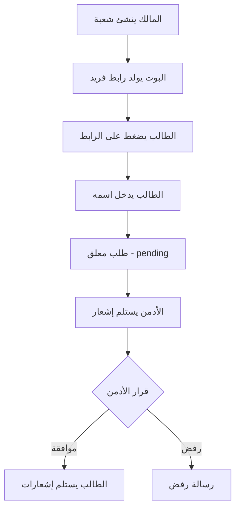

# 🎓 بوت التلغرام الجامعي لإدارة الواجبات

بوت تلغرام متكامل لإدارة الواجبات الجامعية، مع نظام صلاحيات متعدد المستويات (مالك، أدمن، طالب).

## 📋 المحتويات

- [الميزات](#-الميزات)
- [المتطلبات](#-المتطلبات)
- [التثبيت](#-التثبيت)
- [الإعداد](#-الإعداد)
- [الاستخدام](#-الاستخدام)
- [هيكل المشروع](#-هيكل-المشروع)
- [نظام الصلاحيات](#-نظام-الصلاحيات)
- [آلية التسجيل](#-آلية-التسجيل)
- [إدارة الواجبات](#-إدارة-الواجبات)
- [قاعدة البيانات](#-قاعدة-البيانات)
- [الأسئلة الشائعة](#-الأسئلة-الشائعة)

---

## ✨ الميزات

### 👑 للمالك (Super Admin)
- ✅ إنشاء وإدارة الشعب الدراسية
- ✅ تعيين الأدمنز لكل شعبة
- ✅ عرض إحصائيات شاملة للنظام
- ✅ إدارة الإعدادات والميزات
- ✅ الوصول الكامل لجميع البيانات

### 👨‍💼 للأدمن
- ✅ نشر واجبات جديدة
- ✅ تعديل وحذف الواجبات
- ✅ الموافقة/رفض طلبات تسجيل الطلاب
- ✅ إدارة الطلاب (حظر، حذف)
- ✅ عرض إحصائيات الشعبة
- ✅ إرسال إشعارات للطلاب

### 👨‍🎓 للطالب
- ✅ التسجيل عبر رابط الشعبة
- ✅ استلام إشعارات الواجبات تلقائياً
- ✅ عرض قائمة الواجبات
- ✅ عرض معلومات الشعبة

---

## 📦 المتطلبات

### المتطلبات الأساسية
- **Python 3.9+**
- **SQLite 3** (مدمج مع Python)
- **Telegram Bot Token** (من [@BotFather](https://t.me/BotFather))

### المكتبات المطلوبة
```bash
pyTelegramBotAPI==4.14.0
python-dotenv==1.0.0
pytz==2023.3
```

---

## 🚀 التثبيت

### 1. استنساخ المشروع
```bash
git clone https://github.com/your-username/university-bot.git
cd university-bot
```

### 2. إنشاء بيئة افتراضية (اختياري لكن مُوصى به)
```bash
python -m venv venv

# في Windows
venv\Scripts\activate

# في Linux/Mac
source venv/bin/activate
```

### 3. تثبيت المكتبات
```bash
pip install -r requirements.txt
```

---

## ⚙️ الإعداد

### 1. إنشاء بوت تلغرام

1. افتح [@BotFather](https://t.me/BotFather) في تلغرام
2. أرسل `/newbot`
3. اتبع التعليمات واحصل على **Bot Token**

### 2. إنشاء ملف `.env`

أنشئ ملف `.env` في مجلد المشروع:

```env
# Telegram Bot Configuration
BOT_TOKEN=123456789:ABCdefGHIjklMNOpqrsTUVwxyz
BOT_USERNAME=YourBotUsername
BOT_NAME=بوت الواجبات الجامعي

# Owner Configuration
OWNER_TELEGRAM_ID=123456789
OWNER_NAME=المسؤول

# Database Configuration
DB_PATH=university_bot.db

# Section Configuration
MAX_STUDENTS_PER_SECTION=50

# Assignment Configuration
ASSIGNMENT_EDIT_DURATION_HOURS=24

# Timezone Configuration
TIMEZONE=Asia/Baghdad

# Logging Configuration
LOG_LEVEL=INFO
LOG_FILE=bot.log
```

**⚠️ ملاحظات مهمة:**
- استبدل `BOT_TOKEN` بالتوكن الفعلي من BotFather
- استبدل `OWNER_TELEGRAM_ID` بمعرف تلغرام الخاص بك
- للحصول على معرفك: أرسل رسالة لـ [@userinfobot](https://t.me/userinfobot)

### 3. إنشاء قاعدة البيانات

```bash
python create_database.py
```

يجب أن ترى:
```
✅ تم إنشاء قاعدة البيانات بنجاح!
📁 الملف: university_bot.db
```

### 4. إنشاء حساب المالك

قبل تشغيل البوت، يجب إضافة المالك يدوياً:

```python
from database import UserDatabase

# إضافة المالك
UserDatabase.create_user(
    telegram_id=123456789,  # معرفك في تلغرام
    full_name="اسمك الكامل",
    user_type='owner',
    username="@yourusername"  # اختياري
)
```

أو استخدم البرنامج النصي المساعد:
```bash
python setup_owner.py
```

---

## 🎮 الاستخدام

### تشغيل البوت

```bash
python bot.py
```

يجب أن ترى:
```
🤖 بدء تشغيل بوت الواجبات الجامعي
📝 اسم البوت: بوت الواجبات الجامعي
✅ البوت يعمل الآن...
```

### إيقاف البوت

اضغط `Ctrl+C` في الترمنال.

---

## 📁 هيكل المشروع

```
university_bot/
│
├── create_database.py      # إنشاء قاعدة البيانات
├── database.py              # دوال قاعدة البيانات
├── helpers.py               # دوال مساعدة
├── config.py                # الإعدادات
├── bot.py                   # البوت الرئيسي
├── requirements.txt         # المكتبات المطلوبة
├── README.md                # هذا الملف
├── .env                     # المتغيرات البيئية (لا يُرفع على Git)
│
├── university_bot.db        # قاعدة البيانات (تُنشأ تلقائياً)
├── bot.log                  # ملف السجلات (يُنشأ تلقائياً)
└── database_creation.log    # سجل إنشاء قاعدة البيانات
```

---

## 🔐 نظام الصلاحيات

### المستويات الثلاثة

| الدور | الصلاحيات | العدد |
|------|----------|------|
| **👑 المالك** | صلاحيات كاملة على النظام | 1 فقط |
| **👨‍💼 الأدمن** | إدارة شعبته فقط | متعدد (واحد لكل شعبة) |
| **👨‍🎓 الطالب** | استلام الواجبات | متعدد |

### مصفوفة الصلاحيات

| الإجراء | المالك | الأدمن | الطالب |
|---------|--------|--------|--------|
| إنشاء شعبة | ✅ | ❌ | ❌ |
| تعيين أدمن | ✅ | ❌ | ❌ |
| نشر واجب | ✅ | ✅ (شعبته فقط) | ❌ |
| الموافقة على طالب | ✅ | ✅ (شعبته فقط) | ❌ |
| عرض الواجبات | ✅ | ✅ (شعبته فقط) | ✅ (شعبته فقط) |
| حظر طالب | ✅ | ✅ (شعبته فقط) | ❌ |
| الإحصائيات الشاملة | ✅ | ❌ | ❌ |

---

## 📝 آلية التسجيل

### خطوات تسجيل الطالب



### مثال عملي

1. **المالك ينشئ شعبة:**
   ```
   الشعبة: المرحلة الأولى - صباحي - شعبة A
   الرابط: https://t.me/UniversityBot?start=SEC_A7bX9kL2pQ3m
   ```

2. **الطالب يضغط على الرابط:**
   - يرى معلومات الشعبة
   - يطلب منه إدخال اسمه

3. **الأدمن يستلم إشعار:**
   ```
   🆕 طلب تسجيل جديد
   👤 الاسم: أحمد محمد علي
   🆔 المعرف: @ahmed123
   📚 الشعبة: المرحلة الأولى - صباحي - شعبة A
   
   [✅ موافقة] [❌ رفض]
   ```

4. **عند الموافقة:**
   - الطالب يستلم: "🎉 مبروك! تمت الموافقة"
   - يبدأ باستلام الواجبات

---

## 📚 إدارة الواجبات

### إنشاء واجب جديد

**البيانات المطلوبة:**
- 📖 اسم المادة
- 📌 عنوان الواجب
- 📝 وصف الواجب
- ⏰ الموعد النهائي (تاريخ + وقت)

**مثال:**
```
📚 واجب جديد - برمجة 1

📌 العنوان: واجب المصفوفات
📝 التفاصيل: حل التمارين من 1 إلى 5
⏰ الموعد النهائي: 2025-10-20 الساعة 23:59
⏳ الوقت المتبقي: يومان و 5 ساعات

🔔 لا تنسَ التسليم!
```

### إرسال الإشعارات

- يُرسل إشعار **خاص** لكل طالب مُوافق عليه
- يُسجل كل إشعار في قاعدة البيانات
- يُتتبع حالة التوصيل (sent/failed/blocked)

### تعديل الواجب

- الأدمن يمكنه تعديل الواجب
- يُحفظ السجل القديم
- يُرسل إشعار تعديل للطلاب

### حذف الواجب

- حذف **soft delete** (البيانات تبقى)
- يُرسل إشعار إلغاء للطلاب

---

## 💾 قاعدة البيانات

### الجداول الرئيسية

#### 1. `users` - المستخدمون
```sql
- user_id: المعرف الفريد
- telegram_id: معرف تلغرام
- full_name: الاسم الكامل
- user_type: نوع المستخدم (owner/admin/student)
- is_blocked: محظور؟
```

#### 2. `sections` - الشعب
```sql
- section_id: المعرف الفريد
- section_name: اسم الشعبة
- level_id: المرحلة الدراسية
- admin_id: الأدمن المسؤول
- join_code: كود التسجيل الفريد
```

#### 3. `student_sections` - تسجيل الطلاب
```sql
- student_id: معرف الطالب
- section_id: معرف الشعبة
- registration_status: حالة التسجيل (pending/approved/rejected)
- approved_by: من وافق على التسجيل
```

#### 4. `assignments` - الواجبات
```sql
- assignment_id: المعرف الفريد
- section_id: الشعبة
- subject_id: المادة
- title: العنوان
- description: الوصف
- deadline: الموعد النهائي
- created_by: من أنشأه
- is_edited: هل تم تعديله
```

#### 5. `assignment_notifications` - الإشعارات
```sql
- notification_id: المعرف الفريد
- assignment_id: الواجب
- student_id: الطالب
- notification_type: نوع الإشعار (new/edit/delete)
- delivery_status: حالة التوصيل (sent/failed/blocked)
```

#### 6. `activity_logs` - السجلات
```sql
- log_id: المعرف الفريد
- user_id: المستخدم
- action_type: نوع الحدث
- action_details: التفاصيل
- created_at: التاريخ
```

---

## 📊 الإحصائيات

### للمالك
- عدد الشعب الكلي
- عدد الطلاب الكلي
- عدد الواجبات
- عدد الأدمنز
- الطلبات المعلقة

### للأدمن
- عدد الطلاب في شعبته
- عدد الواجبات المنشورة
- الطلبات المعلقة
- إحصائيات الإشعارات

---

## 🔧 الإعدادات المتقدمة

### تشغيل/إيقاف الميزات

```python
from database import SettingsDatabase

# تشغيل ميزة تسليم الواجبات
SettingsDatabase.toggle_feature('assignment_submission', owner_id)

# تشغيل ميزة التذكيرات التلقائية
SettingsDatabase.toggle_feature('auto_reminders', owner_id)
```

### الميزات المتاحة
- ✅ `student_blocking` - نظام الحظر (مُفعّل)
- ⏸️ `assignment_submission` - تسليم الواجبات (معطّل)
- ⏸️ `auto_reminders` - التذكيرات التلقائية (معطّل)
- ⏸️ `warnings_system` - نظام التحذيرات (معطّل)
- ⏸️ `leaderboards` - القوائم التصنيفية (معطّل)

---

## 🐛 استكشاف الأخطاء

### البوت لا يستجيب
```bash
# تحقق من:
1. ملف .env موجود وصحيح
2. BOT_TOKEN صحيح
3. الاتصال بالإنترنت
4. السجلات في bot.log
```

### خطأ في قاعدة البيانات
```bash
# حذف القاعدة وإعادة إنشائها
rm university_bot.db
python create_database.py
```

### الطالب لا يستلم إشعارات
```bash
# تحقق من:
1. الطالب موافق عليه (approved)
2. الطالب غير محظور
3. الطالب لم يحظر البوت في تلغرام
4. السجلات في assignment_notifications
```

---

## ❓ الأسئلة الشائعة

### كيف أحصل على معرف تلغرام الخاص بي؟
أرسل رسالة لـ [@userinfobot](https://t.me/userinfobot)

### كيف أضيف أدمن جديد؟
1. سجّل الأدمن أولاً كمستخدم
2. المالك ينشئ شعبة جديدة
3. يختار الأدمن عند إنشاء الشعبة

### هل يمكن للطالب التسجيل في أكثر من شعبة؟
حالياً لا. الطالب يمكنه التسجيل في شعبة واحدة فقط.

### كيف أغير نوع مستخدم من طالب إلى أدمن؟
```python
from database import UserDatabase

# تحديث نوع المستخدم
UserDatabase.update_user_type(telegram_id, 'admin')
```

### كيف أحذف البيانات القديمة؟
```python
# حذف الواجبات القديمة (أكثر من 6 أشهر)
from database import cleanup_old_assignments
cleanup_old_assignments(months=6)
```

---

## 🤝 المساهمة

المساهمات مرحب بها! يرجى:
1. Fork المشروع
2. إنشاء branch جديد (`git checkout -b feature/AmazingFeature`)
3. Commit التغييرات (`git commit -m 'إضافة ميزة رائعة'`)
4. Push إلى Branch (`git push origin feature/AmazingFeature`)
5. فتح Pull Request

---

## 📄 الترخيص

هذا المشروع مرخص تحت [MIT License](LICENSE).

---

## 📧 التواصل

- **المطور:** [اسمك]
- **البريد الإلكتروني:** your.email@example.com
- **تلغرام:** [@yourusername]

---

## 🙏 شكر وتقدير

- [pyTelegramBotAPI](https://github.com/eternnoir/pyTelegramBotAPI) - مكتبة Telegram Bot
- [SQLite](https://www.sqlite.org/) - قاعدة البيانات
- جميع المساهمين في هذا المشروع

---

## 📝 ملاحظات إضافية

### الأمان
- لا ترفع ملف `.env` على Git
- احفظ نسخة احتياطية من قاعدة البيانات
- استخدم HTTPS عند نشر البوت على سيرفر

### الأداء
- البوت مُحسّن لـ 1000+ طالب
- يُنصح باستخدام Redis للـ caching في حالة الأعداد الكبيرة
- يمكن استخدام PostgreSQL بدلاً من SQLite للأداء الأفضل

### التطوير المستقبلي
- [ ] تسليم الواجبات (ملفات، صور، نصوص)
- [ ] نظام التحذيرات
- [ ] القوائم التصنيفية
- [ ] إحصائيات متقدمة
- [ ] لوحة تحكم ويب
- [ ] دعم متعدد اللغات

---

<div align="center">

**صُنع بـ ❤️ لخدمة التعليم**

⭐ إذا أعجبك المشروع، لا تنسَ النجمة!

</div>

# drs_bot

